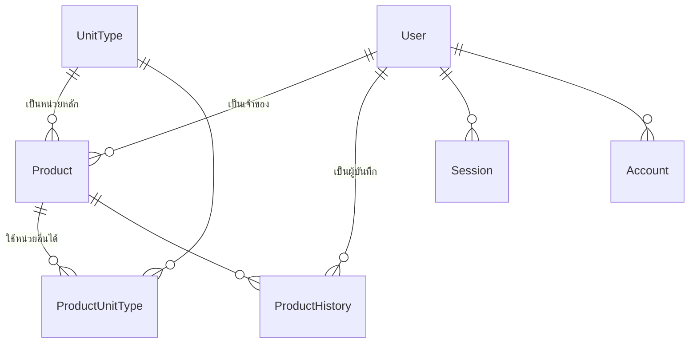

# Stockly — ระบบเช็คสต็อกสินค้า

เว็บจัดการสต็อกสินค้าที่นับของได้หลายหน่วยพร้อมกัน เช่นสินค้าตัวเดียวดูเป็น "ชิ้น" ก็ได้
ดูเป็น "ลัง" ก็ได้ โดยยอดคงเหลือยังตรงกันเสมอ พร้อมประวัติว่าใครปรับสต็อกเมื่อไหร่

- **หน้าแรก (`/`)** — ใครก็เข้าดูสต็อกได้โดยไม่ต้องล็อกอิน ค้นหาสินค้าและกดตัดสต็อกเข้า-ออกได้ (ต้องล็อกอินก่อนถึงจะบันทึกได้)
- **หน้าจัดการ (`/manage`)** — ต้องล็อกอิน ใช้เพิ่ม/แก้สินค้า ตั้งหน่วยนับ และปรับยอด
- **หน้าเข้าสู่ระบบ (`/login`)** — ล็อกอินด้วย Google (OAuth อย่างเดียว ไม่มีรหัสผ่าน)

UI เป็นภาษาไทยทั้งหมด

---

## เทคโนโลยีที่ใช้

| ส่วน | ใช้อะไร | หมายเหตุ |
|---|---|---|
| Framework | **Next.js 16** (App Router + Turbopack) | มี breaking change เยอะจาก v15 — ดู [ข้อควรรู้](#ข้อควรรู้-gotchas) |
| UI | React 19, Tailwind CSS v4, **shadcn** (ฐานเป็น Base UI ไม่ใช่ Radix) | เพิ่มคอมโพเนนต์ด้วย `npx shadcn add <name>` |
| ฟอนต์ | IBM Plex Sans Thai | มีทั้งไทย+ละตินในตระกูลเดียว ผสมกันแล้วน้ำหนักไม่แตก |
| ฐานข้อมูล | PostgreSQL (Supabase) + **Prisma 7** | ใช้ driver adapter `@prisma/adapter-pg` |
| ล็อกอิน | **Better Auth** + Google OAuth | session เก็บใน DB |
| เก็บรูป | Google Drive (ไม่บังคับ) | ไม่ตั้งค่าก็ยังใส่ลิงก์รูปเองได้ |

---

## แนวคิดหลัก: หน่วยนับกับการเก็บยอด

**นี่คือส่วนที่สำคัญที่สุดของระบบ อ่านตรงนี้ก่อนแก้โค้ดที่เกี่ยวกับสต็อก**

### 1. ยอดคงเหลือเก็บเป็น "หน่วยย่อยที่สุด" เสมอ

`Product.qty` เก็บเป็นจำนวนหน่วยย่อยที่สุดตัวเดียว ไม่เก็บแยกตามหน่วย
ส่วน `UnitType.qty` คือ **ตัวคูณ** ว่า 1 หน่วยนั้นเท่ากับกี่หน่วยย่อยที่สุด

```
ชิ้น  = ×1     (หน่วยย่อยที่สุด)
แพ็ค = ×6     (1 แพ็ค = 6 ชิ้น)
ลัง  = ×12    (1 ลัง = 12 ชิ้น)
```

ถ้า `Product.qty = 30` ระบบจะแตกออกมาแสดงเป็น `2 ลัง + 1 ชิ้น` เอง (ฟังก์ชัน `breakdown()` ใน [`lib/stock.js`](lib/stock.js) แตกแบบ greedy จากหน่วยใหญ่ไปเล็ก)

**ข้อดี:** เติมของเป็นลัง ตัดขายเป็นชิ้น ยอดก็ยังตรงกัน ไม่ต้องคอยแปลงเอง

### 2. หน่วยหลักต้องเป็น ×1 เท่านั้น

เพราะยอดที่กรอกจะถูกเก็บลง `Product.qty` ตรง ๆ ถ้าหน่วยหลักเป็น ×12 ยอดจะเพี้ยนทันที
กฎนี้บังคับทั้งตอนสร้างและตอนแก้ไข ทั้งฝั่ง UI (กรองตัวเลือก) และฝั่ง server (ตรวจซ้ำ)

> ข้อยกเว้น: สินค้าเก่าที่หน่วยหลักไม่ใช่ ×1 อยู่แล้ว ยังแก้ชื่อ/รูปได้ตามปกติ
> แต่จะย้ายไปหน่วย ×N ตัวอื่นไม่ได้ — ไม่งั้นข้อมูลเก่าจะติดตายแก้อะไรไม่ได้เลย

### 3. หน่วยหลัก vs หน่วยอื่น

- **หน่วยหลัก** (`Product.unitTypeId`) — หน่วยที่ใช้แสดงยอดเป็นหลัก ต้องเป็น ×1
- **หน่วยอื่น** (`ProductUnitType`) — หน่วยเพิ่มเติมที่ใช้ปรับสต็อกสินค้านี้ได้ เช่นเพิ่ม "ลัง (×12)" เพื่อรับของเข้าเป็นลัง

---

## สิทธิ์การใช้งาน

ทุกคนที่ล็อกอินแล้วเข้า `/manage` ได้ แต่**แก้สินค้าได้เฉพาะสินค้าที่ตัวเองสร้าง**
(`Product.ownerId` = คนที่กดสร้าง) กฎอยู่ที่ [`lib/permissions.js`](lib/permissions.js) ที่เดียว ใช้ร่วมกันทั้ง client และ server

| | เจ้าของ | คนอื่นที่ล็อกอิน | ไม่ได้ล็อกอิน |
|---|---|---|---|
| ดูสต็อก | ✅ | ✅ | ✅ |
| รับเข้า / ตัดออก | ✅ | ✅ | ❌ |
| ตั้งยอดใหม่ (Adjustment) | ✅ | ❌ | ❌ |
| แก้ชื่อ/รูป/หน่วย, ลบสินค้า | ✅ | ❌ | ❌ |

> **ตั้งยอดใหม่ถือเป็นการแก้** เพราะมันเขียนทับยอดเดิมทั้งก้อน ไม่ใช่การเข้า-ออกปกติ
>
> สินค้าที่ `ownerId` เป็น `null` (ของเก่าก่อนมีระบบเจ้าของ) ใครที่ล็อกอินแล้วก็แก้ได้

**สำคัญ:** Server Action ถูกยิงตรงด้วย POST ได้เหมือน API endpoint การซ่อนปุ่มใน UI จึงไม่ใช่การป้องกัน
ทุก action ใน [`app/manage/actions.js`](app/manage/actions.js) ต้องเช็ค session และสิทธิ์เองเสมอ

---

## โครงสร้างโปรเจกต์

```
app/
  page.js                    หน้าแรก (public) — ดูสต็อก + ตัดสต็อก
  manage/page.js             หน้าจัดการ (ต้องล็อกอิน)
  manage/actions.js          Server Action ทั้งหมด ← ด่านตรวจสิทธิ์อยู่ที่นี่
  login/page.js              หน้าเข้าสู่ระบบ
  api/auth/[...all]/route.js endpoint ของ Better Auth
  server/                    ชั้นคุยกับ DB (เรียกจาก server เท่านั้น)
    product.js  unitType.js  productUnitType.js  productHistory.js
    user.js     session.js   ← session.js คือ DAL อ่าน session

components/
  landing/                   หน้าแรก (navbar, hero, การ์ดสินค้า, ค้นหา)
  manage/                    หน้าจัดการ (ตารางสินค้า, กล่องเพิ่ม/แก้/ปรับสต็อก)
  auth/                      ปุ่มล็อกอิน, เมนูผู้ใช้, โลโก้ provider
  ui/                        คอมโพเนนต์พื้นฐานจาก shadcn (ปกติไม่ต้องแก้เอง)

lib/
  stock.js                   ตรรกะหน่วยนับ/แปลงยอด/แตกยอด ← หัวใจของระบบ
  permissions.js             กฎสิทธิ์ต่อสินค้าหนึ่งชิ้น
  auth.js                    ตั้งค่า Better Auth (server)
  auth-client.js             Better Auth ฝั่ง client
  google-drive.js            อัปโหลดรูปขึ้น Drive
  site-config.js             ชื่อเว็บ, เมนู, ข้อความ hero

prisma/
  schema.prisma              โครงสร้างตาราง
  migrations/                ประวัติการเปลี่ยนโครงสร้าง DB
  prisma.js                  สร้าง PrismaClient (ใช้ pg adapter)

proxy.js                     กัน /manage ไม่ให้คนไม่ได้ล็อกอินเข้า (เดิมชื่อ middleware.js)
```

---

## โครงสร้างข้อมูล



**ชื่อ model ในโค้ดกับชื่อตารางใน DB ไม่ตรงกัน** เพราะเปลี่ยนชื่อในโค้ดให้อ่านง่ายขึ้นภายหลัง
แต่ตรึงชื่อตารางเดิมไว้ด้วย `@@map` เพื่อไม่ต้อง migrate ข้อมูลเก่า:

| model ในโค้ด | ตารางจริงใน DB |
|---|---|
| `UnitType` | `QtyType` |
| `ProductUnitType` | `ProductQtyType` |
| `User` / `Session` / `Account` / `Verification` | `user` / `session` / `account` / `verification` (ตัวพิมพ์เล็ก — schema มาตรฐานของ Better Auth **ห้ามแก้ชื่อฟิลด์**) |

`ProductHistory` เก็บ `unitName` กับ `unitAmount` ไว้เป็นข้อความตอนบันทึก **โดยตั้งใจ**
ประวัติจะได้ไม่เพี้ยนถ้าหน่วยถูกลบหรือแก้ทีหลัง (FK เป็น `SetNull`)

---

## เริ่มใช้งาน

```bash
npm install                  # postinstall จะรัน prisma generate ให้เอง
cp .env.example .env         # แล้วเติมค่าตามหัวข้อถัดไป
npx prisma migrate deploy    # สร้าง/อัปเดตตารางใน DB
npm run dev                  # http://localhost:3000
```

### ตัวแปรใน `.env`

| ตัวแปร | บังคับ | ได้มาจากไหน |
|---|:---:|---|
| `DATABASE_URL` | ✅ | connection string ของ Postgres |
| `DIRECT_URL` | ✅ | ต่อตรงไม่ผ่าน pooler ใช้ตอน migrate |
| `BETTER_AUTH_SECRET` | ✅ | `openssl rand -base64 32` |
| `BETTER_AUTH_URL` | ✅ | URL ของเว็บ เช่น `http://localhost:3000` |
| `GOOGLE_CLIENT_ID` / `GOOGLE_CLIENT_SECRET` | ✅ | Google Cloud Console → Credentials → OAuth client ID |
| `GITHUB_CLIENT_ID` / `GITHUB_CLIENT_SECRET` | — | ใส่แล้วปุ่ม GitHub จะโผล่เอง ไม่ใส่ก็ไม่ขึ้น |
| `GOOGLE_DRIVE_*` | — | สำหรับอัปโหลดรูป ไม่ใส่ก็ยังใส่ลิงก์รูปเองได้ |

**redirect URI ที่ต้องลงทะเบียนใน Google Cloud Console:**
```
<BETTER_AUTH_URL>/api/auth/callback/google
```

---

## คำสั่ง

| คำสั่ง | ทำอะไร |
|---|---|
| `npm run dev` | dev server |
| `npm run build` | build production |
| `npm run lint` | ESLint |
| `npx prisma migrate dev --name <ชื่อ>` | สร้าง migration ใหม่จาก schema ที่แก้ |
| `npx prisma migrate deploy` | apply migration ที่ค้างอยู่ (ใช้ตอน deploy) |
| `npx prisma studio` | เปิด GUI ดูข้อมูลใน DB |

---

## ข้อควรรู้ (gotchas)

เรื่องที่เคยทำให้เสียเวลามาแล้ว เขียนไว้กันลืม

### แก้ `schema.prisma` แล้วต้อง restart dev server

`prisma generate` เขียนไฟล์ใหม่ใน `node_modules/.prisma/client` แต่ dev server ที่รันค้างอยู่
ยังถือ client ตัวเก่าไว้ใน require cache → จะฟ้อง `Unknown argument 'xxx'` ทั้งที่ schema ถูกแล้ว
**แก้ schema เมื่อไหร่ = ปิดแล้วเปิด dev server ใหม่เสมอ** (ถ้ายังไม่หายให้ลบโฟลเดอร์ `.next` ด้วย)

### Next.js 16 เปลี่ยนชื่อ `middleware.js` เป็น `proxy.js`

ไฟล์ [`proxy.js`](proxy.js) ที่ root คือตัวเดิม แค่เปลี่ยนชื่อไฟล์และชื่อ export
เอกสารฉบับเต็มอยู่ใน `node_modules/next/dist/docs/` (มี breaking change อื่นอีก — อ่านก่อนเขียนโค้ด)

`proxy.js` เช็คแค่ว่ามี cookie session ติดมาไหม **ไม่ได้ยิง DB** เพราะมันวิ่งทุก request รวม prefetch
cookie ปลอมได้ ของจริงเช็คอีกทีที่หน้า `/manage` และใน Server Action ทุกตัว

### อย่าเติม OAuth scope เข้าไปในตัวล็อกอิน

ถ้าแอปใน Google Cloud ยังอยู่สถานะ **Testing** แล้วเราขอ scope นอกเหนือ `name/email/profile`
**ทุกคนจะล็อกอินไม่ได้ทันที** (403 `access_denied`) เพราะโดนบังคับให้ต้องอยู่ในรายการ Test users
และ refresh token จะหมดอายุทุก 7 วันด้วย

ด้วยเหตุนี้ Google Drive จึงใช้ `GOOGLE_DRIVE_CLIENT_ID` **แยกคนละตัว** กับ `GOOGLE_CLIENT_ID` ที่ใช้ล็อกอิน
ตั้งค่า Drive พลาดยังไงระบบล็อกอินก็ไม่พังตาม

### Service account อัปโหลดขึ้น Google Drive ส่วนตัวไม่ได้

Google ตัดโควตาที่เก็บของ service account ไปแล้ว (`storageQuota.limit = 0`)
ไฟล์ที่มันสร้างจะเป็นของมันเอง → โดน 403 `Service Accounts do not have storage quota`
**แชร์โฟลเดอร์จาก Drive ส่วนตัวให้ service account ก็ไม่ช่วย** เพราะเจ้าของไฟล์ยังเป็น service account อยู่ดี

ทางที่ใช้ได้จริง:

| วิธี | ใช้ได้เมื่อไหร่ |
|---|---|
| Shared Drive + service account | ต้องมี Google Workspace |
| OAuth refresh token ของบัญชีจริง | ใช้กับ Gmail ทั่วไปได้ ไฟล์กินโควตา 15GB ของบัญชีนั้น |

โค้ดใน [`lib/google-drive.js`](lib/google-drive.js) รองรับทั้งสองแบบและเลือกให้อัตโนมัติ

### ลิงก์รูปจาก Google Drive

ลิงก์แชร์ปกติ (`drive.google.com/file/d/.../view`) เป็นหน้าเว็บ ใส่ใน `` ไม่ขึ้น
โค้ดเลยเก็บเป็น `drive.google.com/thumbnail?id=<id>&sz=w1000` ซึ่งคืนไฟล์รูปตรง ๆ
**ผลข้างเคียง: GIF จะไม่ขยับ** เพราะ endpoint นี้เรนเดอร์เป็นภาพนิ่ง

### อัปโหลดไฟล์ผ่าน Server Action จำกัด 1MB โดย default

ตั้ง `serverActions.bodySizeLimit` ไว้ที่ `6mb` ใน [`next.config.mjs`](next.config.mjs) แล้ว
ส่วนตัวไฟล์จริงจำกัด 5MB อีกชั้นในโค้ด (เผื่อ overhead ของ multipart)

### รูปที่อัปโหลดแล้วไม่ได้ใช้จะค้างอยู่

ถ้าอัปโหลดรูปแล้วกดยกเลิก หรือเปลี่ยนรูปใหม่ ไฟล์เก่าจะยังอยู่ใน Drive ไม่ได้ลบตาม
ตอนนี้ยังไม่มีระบบเก็บกวาด

---

## แนวทางเขียนโค้ดในโปรเจกต์นี้

- **คอมเมนต์เขียนเป็นภาษาไทย** และอธิบาย *ทำไม* ไม่ใช่ *ทำอะไร* — โค้ดบอกอยู่แล้วว่าทำอะไร
- **ตรรกะที่ใช้ร่วมกันทั้ง client และ server อยู่ใน `lib/`** (เช่น `stock.js`, `permissions.js`)
  ห้ามเขียนกฎเดียวกันซ้ำสองที่ เพราะเดี๋ยวมันจะเพี้ยนกันเอง
- **Server Action ต้องตรวจค่าและสิทธิ์เองทุกตัว** ห้ามเชื่อว่า UI กรองมาแล้ว
- **ไฟล์ใน `app/server/`** เรียกจากฝั่ง server เท่านั้น ห้าม import จาก Client Component
- **ข้อความใน UI เป็นภาษาไทย** รวมถึง `aria-label` และ `sr-only` (screen reader จะได้อ่านถูก)
